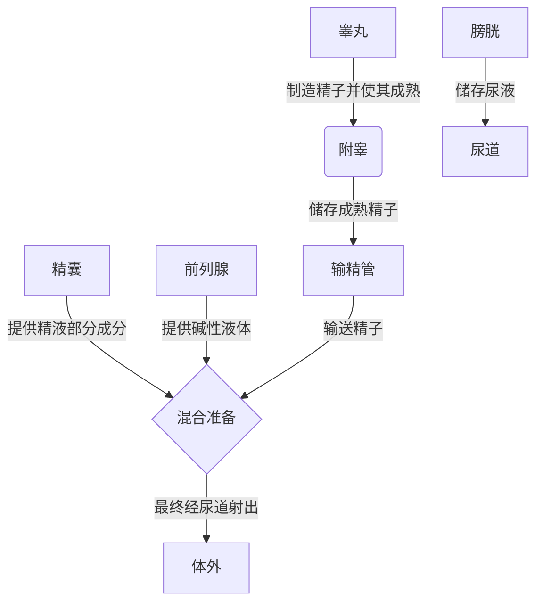

# 03.许蓝方博士：《正确认识爱与性～陪你长大》：7-第六课：认识你自己——男生篇(1955

在本节课中，我们将学习男性在青春期阶段的生理发育知识，包括内外生殖器的结构、功能以及日常护理方法。了解这些基础知识，有助于我们正确认识自己的身体变化，建立健康的卫生习惯，并为未来的身心健康打下基础。

## 认识生理性别与性征

上一节我们介绍了青少年的整体发育。本节中，我们来看看如何从生理特征上区分性别。

第一性征是指与生俱来的生殖器官，这是区分男女生理性别的基础。男生具有外生殖器，而女生具有外阴部和隆起的胸部。这些特征通常在女生10岁左右、男生12岁左右开始出现明显变化。

## 外生殖器的结构与认识

了解身体的结构是正确认知的第一步。以下是男性外生殖器的主要组成部分及其功能。

*   **阴茎**：阴茎内部并非由骨骼构成。其内部结构主要包括：
    *   **尿道**：位于阴茎下方，是一个用于排尿和排精的通道。
    *   **阴茎海绵体**：左右各一，是阴茎勃起的主要组织。其发育速度因人而异，可能导致勃起时阴茎偏向左侧、右侧或保持正中，**这都属于正常现象**。
    *   **尿道海绵体**：包裹着尿道的一圈组织。

*   **阴囊**：阴茎下方的皮肤囊袋，其内部容纳着睾丸。阴囊通常一高一低，这是为了避免行走时睾丸相互摩擦，属于正常生理结构。

*   **包皮**：包裹龟头的皮肤皱襞。其长度因人而异，可能覆盖或部分覆盖龟头。是否需要割包皮，取决于个人具体的生理状况。

## 生殖器的健康与护理

认识结构后，维护其健康至关重要。以下是关键的护理原则。

*   **健康发育**：阴茎的发育主要受男性荷尔蒙影响。青春期摄入过多油脂（如薯条、炸鸡）可能干扰荷尔蒙平衡，影响发育。成年后，阴茎长度基本固定。
*   **正确清洁**：每日清洁是预防感染的关键。清洁时，应将包皮轻轻退下，用清水冲洗**冠状沟**（龟头下方的一圈凹陷处）。避免使用肥皂或沐浴露，以免刺激粘膜或导致干燥瘙痒。
*   **定期自检**：建议每月在洗澡时检查一次睾丸。用拇指和食指、中指轻轻转动触摸睾丸，感受其是否有弹性、有无硬块或突出物。大小可用“OK”手势粗略比对，能套入即大致正常。发现异常应及时就医。

## 内生殖器的功能

内生殖器虽然看不见，但承担着制造精子、维持男性特征的核心功能。

以下是内生殖器的主要部件及其作用流程图：

此外，**尿道球腺**会在性兴奋时分泌少量液体（预射精液），此液体可能含有残余精子，因此为安全起见，勃起时即应使用保险套。

## 常见生理现象答疑

了解原理后，一些常见的生理现象就更容易理解了。

*   **为何不能同时排尿和射精？** 排尿时膀胱颈打开，尿液流出；射精时膀胱颈关闭，精液经尿道射出。两者由不同的神经肌肉控制，因此无法同时进行。
*   **有射精感但无精液射出？** 这可能是一种异常情况，即射精时膀胱颈未能关闭，导致精液“逆行”进入膀胱，随后随尿液排出（尿液变浑浊）。出现此情况需咨询泌尿科医生。

## 总结与核心观念

本节课中，我们一起学习了男性生殖系统的结构、功能和护理知识。

总结核心要点如下：
1.  **正确认识**：每个人的生理构造（如阴茎弯曲方向、睾丸高低、包皮长短）都存在个体差异，只要功能正常，即为健康。
2.  **坚持护理**：每日用清水正确清洁，特别是冠状沟部位。
3.  **定期检查**：每月一次睾丸自检，关注其形态与触感变化。
4.  **全面理解**：性是生活的一部分，但并非全部。在了解身体的基础上，应追求心理与生理的共同成熟。

了解自己的身体，能帮助消除不必要的困惑与恐惧。性可以好奇，可以探讨，但不应成为思想的全部。正确、健康地长大，意味着能平和地接纳与认识这一切。