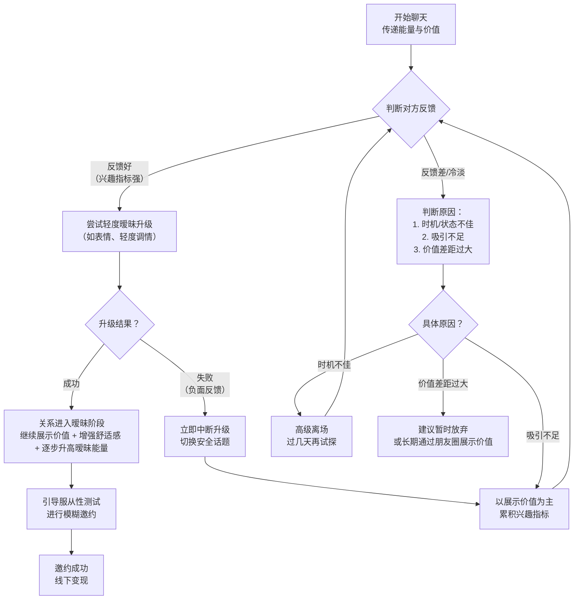

# 聊天高阶：03：社交直觉（核心重点）

## 概述
在本节课中，我们将要学习聊天中的高阶技能——社交直觉。社交直觉是聊天领域的核心内功，它并非理论知识，而是通过大量实战经验积累而成的感知能力。掌握它，你将能精准解读对方话语背后的真实意图，判断聊天时机，并有效引导关系升级。本节课将为你解析社交直觉的运作逻辑，并提供一套清晰的实践框架。

## 前沿：聊天的前提与环境
在深入社交直觉之前，我们必须明确聊天的前提：一切以客观环境和时机为准。找准聊天的大背景至关重要。

以下是需要注意的关键点：

*   **把握黄金时间**：对于多数上班族，晚上9点至11点是聊天的最佳时段。此时对方通常较为放松，有更多精力进行社交互动。白天若非对方主动，尽量避免开启深度聊天。
*   **判断对方状态**：通过朋友圈等渠道观察对方近期状态。如果对方设置朋友圈三天可见、清空动态，或流露出情绪低落、繁忙的迹象，这通常意味着当前并非合适的聊天时机。强行开启话题可能招致负面反馈。
*   **抓住窗口期**：刚认识一个女生的前一周是关系升级的黄金窗口期。在此期间，如果对方反馈良好，应积极互动，推进关系。若怠慢或错过这个时期，对方的兴趣和窗口可能会迅速关闭。

**核心公式：聊天成功率 ∝ (环境适宜度 × 时机把握度)**

上一节我们强调了外部环境的重要性，本节中我们来看看如何运用社交直觉，在良好的环境下进行有效的互动和关系推进。

## 社交直觉的核心：识别反馈与关系升级循环
社交直觉的本质，在于通过对方的反馈（兴趣指标）来判断吸引力的强弱，并据此决定是继续展示价值、提供舒适感，还是尝试升级关系。整个过程是一个动态的、循环验证的过程。

下图清晰地展示了基于社交直觉的聊天决策流程：

### 1. 建立吸引与识别反馈
一切始于吸引。我们通过朋友圈展示、聊天中的价值植入等方式建立初步吸引。

当吸引建立后，女生的反馈会发生变化。你需要识别以下**兴趣指标**：

*   主动开启话题或接话。
*   聊天字数变多，情绪变得积极。
*   主动询问你的个人信息、生活状态。
*   对你的朋友圈内容进行评论或点赞。
*   发送语音、照片，甚至带有轻微诱惑性的内容。

**核心逻辑**：当女生开始在你身上投入时间、精力进行探索时，即表示吸引开始生效。反馈越好，动能越强，意味着吸引力越足。

### 2. 尝试暧昧升级
当识别到足够的兴趣指标（即“有吸引”）后，不应停留在原地，而要尝试带领关系向暧昧方向升级。

以下是升级关系的原则与方式：

*   **判断吸引等级**：根据兴趣指标的强弱（如主动程度、互动深度）大致判断对方对你的好感度（1-10分）。不同分数对应不同的关系阶段。
*   **循序渐进升级**：
    *   **轻度升级（安全）**：适用于好感度初步建立时。主要使用**表情包**进行试探，例如“捏脸”、“害羞”、“狗狗互动”等带有轻度暧昧和情绪价值的表情。这种方式抵抗最弱。
    *   **中度升级**：当好感度更高时，可以使用**场景化、模糊化的语言**进行调情。例如：“你这个身高，踮起脚刚好能闻到我的唇。” 将暧昧包裹在浪漫想象中，而非直白的冒犯。
    *   **重度升级**：关系非常亲密后，方可使用更直接的性张力语言。**注意因人而异**，需判断对方性格和开放程度。
*   **关键：避免跳跃**：如果只有3-4分好感，却做了7-8分好感才该做的事（如直白叫“宝宝”、直接邀约回家），会导致需求感暴露，被对方视为轻浮或饥渴，可能导致关系降级甚至被拉黑。

### 3. 处理升级结果：成功与失败
升级尝试后，对方的反应决定了下一步行动。

**A. 升级成功**
*   **表现**：对方不抗拒，甚至配合互动，开始打情骂俏，情绪高涨。
*   **应对**：
    1.  **继续展示价值与舒适感**：不要停止吸引力的建设，继续穿插展示个人价值和提供安全感的话题。
    2.  **逐步升高暧昧能量**：从表情互动升级到语言调情，暧昧程度逐步加深。
    3.  **引入框架反转（高阶技巧）**：当对方越来越投入时，可以尝试将“你想占有她”的框架，反转为“她总想占你便宜”。例如：“你这么调皮，我见面真担心被你扑倒。” 这能巧妙降低你的需求感，放大她的需求感，引导她主动追逐。
    4.  **进行服从性测试与邀约**：让对方叫你早安晚安、提醒你吃饭等。服从性好，则给予奖励（口头夸奖、承诺小奖励）。最终进行模糊邀约，敲定见面。

**B. 升级失败**
*   **表现**：对方不说话、中断聊天、回复流汗/尴尬表情、或进行废物测试（如：“你是不是对谁都叫宝宝？”）。
*   **核心原因**：吸引力还不够支撑当前的关系升级程度。
*   **标准化应对流程**：
    1.  **立即中断升级**：绝不再提刚才的暧昧话题。
    2.  **不要在意，自然切换**：表现得若无其事，不要道歉或解释。
    3.  **另起安全话题**：开启一个中性、安全的新话题（如电影、宠物、第三方事件）。
    4.  **继续展示价值与舒适感**：在新话题中，继续自然地植入你的价值、魅力，并提供舒适感。
    5.  **重新累积兴趣指标**：通过上述互动，重新累积对方的好感。当再次观察到正反馈时，意味着吸引力回升，可以再次尝试更轻度的升级。

**这个“展示价值 -> 试探升级 -> 根据反馈调整”的循环，是社交直觉在实战中的核心应用模式。**

### 4. 需要警惕的聊天模式
在掌握正确流程的同时，必须避免以下致命错误：

*   **舔狗模式**：在吸引未建立时，就过早付出、过度关心、姿态过低。一旦被对方识别出舔狗特质，极易被永久打入“冷宫”或直接删除。
*   **急色模式**：无视兴趣指标，在聊天初期就使用大尺度语言、直接邀约或发露骨图片。这会被视为极度轻浮和低价值，导致直接拉黑。
*   **永不升级模式**：一直只展示价值，从不尝试带领关系升级。最终会被对方划入“好朋友”、“好兄弟”区域，失去发展浪漫关系的窗口。

### 5. 特殊情况处理
*   **网络资源（探探/陌陌）异常主动**：如果对方在你价值展示一般的情况下异常主动，需警惕酒托、饭托、诈骗等可能性。务必进行**服从性测试**（如要求发一句特定语音、核实位置信息），并选择公共场所见面，避免去对方指定的地点。
*   **价值碾压与快速通道**：如果你的朋友圈建设（展示面）价值极高，形成碾压优势，可能会跳过许多中间步骤。对方可能因强烈的吸引而窗口大开，此时流程可以大大简化，快速进入邀约阶段。但这建立在“硬价值”足够突出的基础上。

## 总结
本节课我们一起学习了聊天中至关重要的高阶技能——社交直觉。我们首先明确了聊天需要选择合适的时机和环境。核心内容在于掌握一个动态循环：通过**传递价值建立吸引** -> **识别对方兴趣指标** -> **尝试适度暧昧升级** -> **根据反馈结果（成功则继续升高并邀约，失败则退回展示价值）** 进行调整。

记住关键原则：**没有吸引，不要升级；吸引不足，升级必败**。社交直觉就是让你精准判断“吸引力刻度”的能力。请将本文中的决策流程图反复研习，并在实战中不断验证和积累经验，最终你将能从容驾驭聊天节奏，有效推进关系。