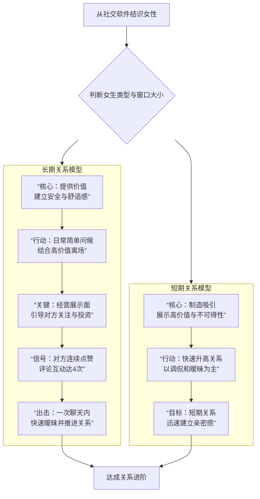

# 男哥1.0+2.0：2017年课程：内部课4：内部课4：内部课4：浩然内部课11.30_note

## 概述
在本节课中，我们将学习如何与女性进行有效沟通，并推进关系。课程将拆解聊天的核心逻辑、常见错误以及针对不同类型女性的策略框架。我们将从基础概念入手，逐步构建一个清晰、可操作的行动指南。

## 核心概念：价值传递与投资平衡
上一节我们提到了聊天的基础，本节中我们来看看核心的底层逻辑。所有互动本质上都是价值的传递与交换。

**核心公式**：`吸引力 = 传递的价值 / 需求感`

*   **传递的价值**：通过你的言语、状态、展示面所呈现的自身特质。
*   **需求感**：你表现出对对方的需要程度。

女生喜欢你，本质上是因为你身上有她所看重的价值，并且她为你**投资**了时间、精力和情感。你的每一句话、每一个表情，都在传递你是一个怎样的人。

## 聊天中的常见错误与纠正
理解了核心概念后，我们来看看实践中常犯的错误。以下是初学者在聊天中最容易踩的坑：

1.  **纠缠话题本身**：对话停留在表面信息交换，例如纠结“摩吉陀加了10滴百加德”是什么，而没有借此展示自己。
    *   **正确做法**：将话题引向自身状态或感受。例如：“冬天喝点白酒确实暖和，忙碌一天后小酌一下，晚上睡得更安稳。”

2.  **过度关注对方**：表现出对女生过分的关注和期待，例如“今天终于有一条不是广告的朋友圈了”。
    *   **正确做法**：保持平衡，不暴露强烈需求感。关注点应放在互动本身，而非对方的一举一动。

3.  **跪舔与低姿态**：用讨好的语气沟通，例如“我愿意做第一个（夸你的人）”。
    *   **正确做法**：保持平等甚至略微主导的姿态。可以风趣地回应：“想太多，说你可爱也没用啊……做你男朋友才有用。” 以玩笑的方式表达兴趣，而非祈求。

4.  **无效抽离**：在不知道如何推进时，生硬地结束对话，美其名曰“抽离”。
    *   **正确做法**：抽离需要结合“高价值离场”。例如：“我有个会要开，先聊到这。”“我去健身了，回头说。” 在互动尚可时主动结束，留下意犹未尽的感觉。

5.  **暴露需求感**：过早或过于直白地表达兴趣，例如“才发现啊（我贴心）？”“刚才准备上去亲你一番”。
    *   **正确做法**：用分享感受或植入模糊预期来代替。例如：“我觉得两个人多接触才能发现对方更多优点，我喜欢慢一点。” 为未来的约会埋下伏笔。

## 关系推进的双路径模型
认识了错误，我们需要正确的行动框架。根据女生的反馈和窗口大小，关系推进主要有两种路径。

以下是针对不同女性类型的策略选择图：

**长期关系模型详解（慢热型）**：
*   **初期**：以提供价值、建立安全感和舒适感为主。聊天内容轻松，避免过度升高关系。
*   **中期**：每次聊天后“高价值离场”，同时精心经营朋友圈（展示面），让对方从侧面了解你的生活。
*   **信号**：当对方开始持续关注你（如连续点赞、评论4次），说明投资和兴趣已经累积。
*   **出击**：此时开启聊天，可以直接使用更暧昧的语气和表情测试窗口，并在一到两次聊天内快速推进关系。因为前期的价值铺垫和安全感已经建立。

**短期关系模型详解（快速型/窗口大）**：
*   **核心**：快速吸引，展示高价值。
*   **方式**：对话以调侃、暧昧（CT）为主，快速建立亲密感。
*   **目标**：明确指向短期关系，节奏快。

**定律**：从认识到发生关系的**时间跨度**，与关系的**持久度**大致成正比。发展越快，关系可能越短暂；发展越慢，关系可能越稳定。你可以通过控制节奏来引导关系的走向。

## 展示面：你的无声名片
无论哪种路径，展示面都至关重要。它是你传递价值的主要载体。以下是打造合格展示面的要点：

*   **避免低质量自拍**：如果颜值不是特别突出（7分以下），尽量避免大头照或清晰怼脸自拍。
*   **追求整体感觉**：照片应传递出你的生活状态、品味和气质。场景、服装、构图都要讲究。
*   **制造反差与统一**：不同照片可以展示不同面（如商务、休闲、运动），但整体风格和质感要统一，避免突兀。
*   **杜绝无效摆拍**：避免“看书”、“端咖啡”等生硬、过时的摆拍。自然的生活瞬间更有说服力。
*   **注意细节**：袜子、配饰、背景环境等细节不能穿帮或显得廉价，否则会破坏整体氛围。
*   **少即是多**：不要堆砌元素。一张干净、有故事感的照片，胜过十张杂乱无章的照片。

## 实用资源与建议
理论需要结合实践素材。为了提升你的聊天内容和幽默感，建议多浏览“内涵段子”这类平台。里面大量的搞笑、扎心、走心段子和情话，可以用接地气的方式转化为聊天素材，增加趣味性和共鸣感。

## 总结
本节课我们一起学习了与女性互动的核心框架：
1.  **底层逻辑**是价值传递与投资平衡。
2.  **聊天中**要避免纠缠话题、过度关注、跪舔、错误抽离和暴露需求感。
3.  **关系推进**分为“长期关系模型”（针对慢热型，重在价值铺垫与等待窗口）和“短期关系模型”（针对窗口大型，重在快速吸引与升高）。
4.  **展示面**是你的无声名片，需要精心打造，传递整体价值感。
5.  **日常积累**可以借助“内涵段子”等丰富聊天素材库。

记住，第一步是**不犯错**。先确保你的聊天安全、自然，不去破坏吸引，然后再学习如何有效推进。扎实走好每一步，效果自然会显现。