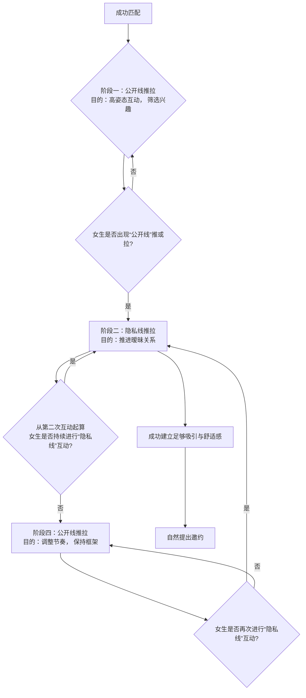

# Ney艾克《调·情》：3、社交软件成功邀约的方法：3、社交软件成功邀约的方法_note

在本节课中，我们将系统性地学习如何从社交软件匹配开始，通过一系列精心设计的聊天步骤，最终成功将女生约出来。整个过程就像按照蓝图施工，每一步都有其明确的目的和操作方法。

---

## 📚 课程回顾与本节定位

上一节我们重点讲解了如何通过展示面（朋友圈等）吸引女生，让她愿意与你开启对话。这是成功邀约的前提。本节中，我们来看看如何运用第一节课学到的“推拉”等核心聊天技巧，按照一个清晰的流程图，从打招呼开始，一步步引导对话，直至完成线下邀约。

具体的聊天技巧（如推拉）已在第一节课详细讲解。本节课的核心是**流程**，即告诉你这些技巧应该在什么阶段、以何种顺序使用。

---

## 🧠 核心能力准备：网聊三要素

在进入正式流程前，你需要掌握三个核心的聊天能力。它们是构建所有对话的基础。

### 1. 明确“推”与“拉”的定义
*   **推**：让女生产生**消极情绪**的行为。例如：开玩笑地嫌弃她、提出一个小挑战。
*   **拉**：让女生产生**积极情绪**的行为。例如：真诚地夸奖她、表达对她的兴趣。
    *   核心：必须以女生的感受为准，让她开心才算成功的“拉”。

### 2. 运用“动作描写”制造画面感
文字聊天无法直接刺激对方的感官（视觉、听觉等），因此需要通过文字在对方脑海中构建画面，从而引发情绪。
一个完整的“动作描写”包含四个要素：
1.  **动作对象**：谁？（例如：我和你）
2.  **动作行动**：做什么？（例如：看电影、吃饭）
3.  **动作环境**：在哪里？（例如：在XX高级餐厅、在私人影院）
4.  **动作感受**：感觉如何？（例如：会很浪漫、应该很开心）

**公式示例**：
> “（动作对象）我想（动作行动）约你周末去那家能看到江景的餐厅（动作环境）吃饭，感觉会是很棒的体验（动作感受）。”

**操作要求**：你发出的每一条重要信息，都应尽量包含这四个要素，使其生动、有代入感。

### 3. 在对话中“植入价值”
为了让女生持续以良好的态度与你互动，你需要适时展示自己的高价值。无需直接吹嘘，只需巧妙修改“动作描写”中的元素：
*   **修改动作对象**：将普通对象替换为高价值对象。例如，“我在吃饭” → “我刚和一位创业很成功的朋友吃完饭”。
*   **修改动作行动**：将低价值行动替换为高价值行动。例如，“我在家看电视” → “我刚健身完”。
*   **修改动作环境**：将普通环境替换为高价值环境。例如，“在咖啡馆” → “在我在三亚租的别墅阳台”。

**注意**：这是基于你真实生活的优化，而非虚假编造。

### 4. （加分项）让开场白“与众不同”
在第一次打招呼或重启话题时，你的信息就像公众号标题，需要在众多追求者中脱颖而出。
**方法**：否定你脑海中**第一个**想到的普通动作（如“嗨”、“在干嘛”），替换成一个更新颖、更具体的动作。
*   **第一个想法**：“你好，可以认识一下吗？”
*   **否定并替换**：“你照片里的笑容很有感染力，让我突然想推荐一部超搞笑的电影给你。”

此技巧仅用于**初次开启对话**和**重启话题**的关键时刻。

---

## 🗺️ 核心流程图：从匹配到邀约

以下是整个聊天流程的思维导图。你的所有对话都将围绕此框架展开。

**流程详解与判断标准**

#### **阶段一：公开线推拉**
*   **目标**：以高姿态、不掉价的方式开启互动，同时展示价值，等待女生对你产生兴趣信号（即“想吃掉你”的状态）。
*   **什么是“公开线”话题**：可以公开给朋友看、不会尴尬的聊天内容。通常是轻松、幽默、略带评价的。
*   **操作**：使用“动作描写”进行推拉。例如：“你五官很精致啊（拉），不过好像不太上镜（推）。”
*   **进入下一阶段的条件**：当女生开始对你进行“公开线”的推或拉时（即她对你的话题产生了情绪反馈）。

#### **阶段二：隐私线推拉**
*   **目标**：将关系推向暧昧。话题涉及私人、亲密、甚至性暗示的内容。
*   **什么是“隐私线”话题**：不能公开给朋友看，只属于两人之间的私密对话。
*   **操作**：立即从公开话题切换到隐私话题进行推拉。例如：“你昨晚是不是做小偷去了，都没回我（隐私推）？梦见我了吧（隐私拉）。”
*   **关键规则——第二次起算**：完成一次“隐私线推拉”组合后，**忽略女生的第一次回应**，以她的**第二次回应**作为判断依据。
    *   如果她第二次回应仍是“隐私线”互动（无论推拉），则**重复阶段二**。
    *   如果她第二次回应变回“公开线”话题，则**进入阶段四**。

#### **阶段四：公开线推拉**
*   **目标**：当女生从隐私话题退缩时，你主动退回到安全区域，保持框架，不暴露需求感。
*   **操作**：果断切换回“公开线”话题进行推拉。
*   **关键规则**：同样遵循“第二次起算”原则。如果女生在后续互动中再次进行“隐私线”互动，则立刻**跳回阶段二**。

#### **关于无回应与耐心**
*   如果你主动发起三次对话（一个推拉组合算一次），女生均无回应，请放弃这个目标。原因可能是吸引力不匹配或展示面不到位。
*   整个流程考验的是**耐心**。把妹不是瞬间魔法，而是根据蓝图和对方反馈，持续、稳定地操作流程。

---

## 💎 本节课总结

本节课我们一起学习了社交软件邀约的完整心法和流程图。关键在于：
1.  **掌握基础**：理解“推拉”本质，学会用“动作描写”制造画面感，并懂得在对话中自然植入价值。
2.  **遵循流程**：严格按照“公开线推拉 → 隐私线推拉 → (根据反馈循环或切换)”的流程图进行对话，核心是观察女生反馈并执行“第二次起算”规则。
3.  **保持耐心与框架**：把妹是系统工程，需要耐心执行每一步。你的高姿态和稳定框架是吸引力的重要组成部分。

记住，所有技巧都建立在第二节课“展示面建设”的基础上。如果你的展示面足够好，流程推进会快得多。明天我们将继续学习，从成功邀约见面到进入私密空间的后续流程。