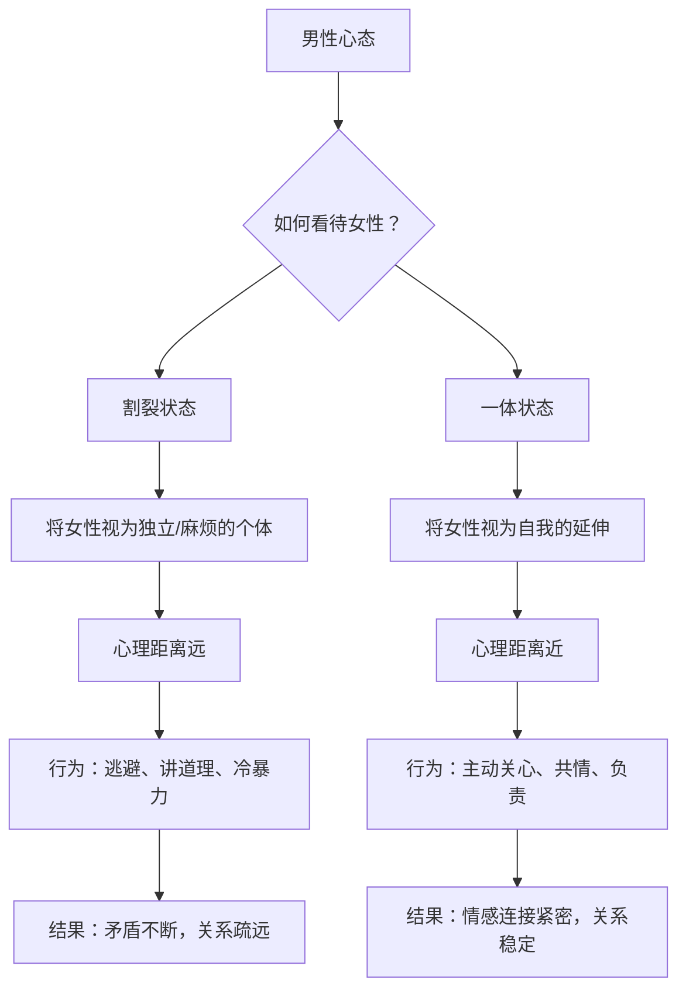

# 与女生交往中为何女生总在抱怨你

在本节课中，我们将探讨亲密关系中一个普遍存在的困惑：为何男性常常感到与女性“不在一个频道上”。我们将深入分析矛盾产生的根源，并理解女性在关系中的核心需求，从而学习如何有效经营一段健康的亲密关系。

---

## 男女相处的主要矛盾由来 🔍

上一节我们提出了核心问题，本节中我们来看看矛盾是如何产生的。男女在亲密关系中的主要矛盾，通常源于关注点的根本性差异。

**女性对男性的不满**，大多是因为感到对方“不上心”。具体表现为，在她遇到事情或情绪波动时，男性没有提供相应的**情感支持**。请注意，这里的关键是“情感支持”，而非实际解决问题。女性需要的是被重视的感觉，以及与你之间的**情感连接**。

**男性对女性的不满**，则大多源于认为对方“不理解自己”。男性会觉得女性妨碍了自己做事情（无论是工作还是娱乐），并且感受不到对方能为己方分担压力。这常常导致男性采取逃避或冷暴力的态度。

当双方关注点错位时，矛盾便产生了：女性感到绝望，认为对方不关心自己；男性则感到委屈，认为自己辛苦付出却还要面对无理取闹的情绪。

---

## 为何总抱怨“不在一个点上”？🎯

理解了矛盾来源后，本节我们聚焦于那个经典抱怨：“我们俩永远不在一个点上。”这通常源于对女性需求核心的误解。

以下是女性常说的三句话，以及男性常见的理解偏差：

1.  **“你要疼我、爱我、照顾我。”**
    *   **男性常见误解**：理解为物质满足，如买礼物、请吃饭、随叫随到。
    *   **核心实质**：这是一种**态度需求**，是希望成为你心里“特别的牵挂”，感受到持续的关心和重视。

2.  **“有争吵时，你要让着我。”**
    *   **男性常见误解**：理解为无条件的顺从和道歉，常说“对不起”以求快速平息事态。
    *   **核心实质**：是希望看到你为**关系负责的态度**，以及积极解决问题的意愿，而非敷衍的认错。

3.  **“家是讲感情的地方，不是讲道理的地方。”**
    *   **男性常见误解**：完全懵懂，不知如何应对，或试图在倾听后“讲道理”说服对方。
    *   **核心实质**：强调**情感共鸣优先于逻辑辩论**。当女性情绪激动时，她首先需要的是情感上的接纳与共情，而非对错分析。

**关键点在于**：女性在冲突中，首要关注的是**对方的态度**，而非事件本身的对错。一句“你居然凶我”往往比任何道理都更能概括她的感受。

---

## 经营亲密关系：男性的主要任务 🛠️

既然我们明白了问题的关键，本节中我们来明确男性在经营亲密关系中的核心任务。这并非技巧的堆砌，而是心态的根本转变。

首先，必须认识到：**女性对男性的核心需求，从始至终都是“关心”**。这是一种希望被体贴、被关照的性别定向需求。

许多关系出现问题的男性，其根本在于一种“割裂状态”：

要进入“一体状态”，男性需要完成心态的转变，其核心任务可以概括为：**成为关系的稳定器，优先处理情感连接**。

这意味着：
1.  **关系优先**：在“搞定自己的事”之前，先学会“搞定关系”。一个情绪稳定、感到被爱的伴侣，才会成为你坚实的后盾，而非后院的“火源”。
2.  **负责而非应付**：主动承担起维护关系和谐的责任，而不是像守门员一样被动地应对对方“踢”过来的情绪球。
3.  **扩大心理边界**：将对方的感受纳入自己的关心范围，学会从“我们”而不仅仅是“我”的角度思考问题。

---

## 给男性的四条核心建议 📝

基于以上分析，以下是四条至关重要的行动建议，旨在帮助你建立更和谐的亲密关系。

**以下是具体可操作的四条建议：**

1.  **将“关心”落到实处**：关心不仅是物质付出，更是日常的倾听、情绪的觉察和即时的情感回应。在她需要时，一句“我真希望此刻能在你身边”远比一堆解决方案更能传递关心。
2.  **理解“让”的内涵**：“让”代表着主动承担和解决问题的意愿。当矛盾发生时，聚焦于“我能做些什么来改善现状”，而不是纠结于“谁对谁错”或简单说“对不起”。
3.  **优先处理情绪，再处理事情**：当对方有情绪时，首先给予情感上的接纳和共情（如“这件事让你这么难受，一定很辛苦”），待情绪平复后，再理性探讨解决方案。
4.  **学会认可与包容**：真诚地认可对方的付出和价值（哪怕只是琐碎家务），包容她偶尔的情绪波动。温柔、坚定的态度能极大增强对方的安全感和归属感。

---

## 总结与回顾 📚

本节课中，我们一起学习了亲密关系中“不在一个频道”这一核心矛盾的根源与解法。

我们首先分析了矛盾来源于男女双方关注点的差异：女性重情感连接与态度，男性重问题解决与事实。接着，我们剖析了男性对女性核心需求的常见误解，指出其本质是**持续的关注和情感上的重视**。然后，我们明确了男性在关系中的主要任务是**以“一体感”的心态，优先经营情感连接，成为关系的稳定器**。最后，我们给出了四条具体的建议：落实关心、理解退让、情绪优先、学会认可。

记住，经营亲密关系不是一套可机械执行的方法，而是一种将对方真正纳入内心的态度转变。当你开始用“我们”的视角去思考和感受时，很多曾经的困惑便会迎刃而解。