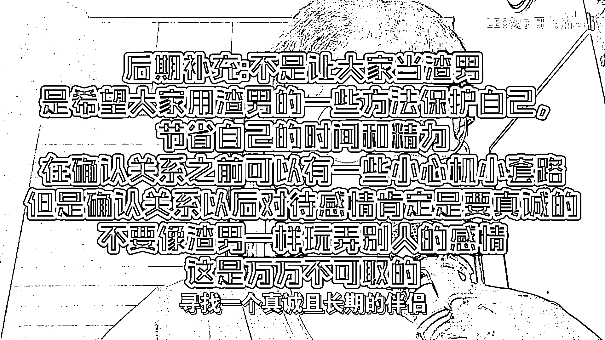
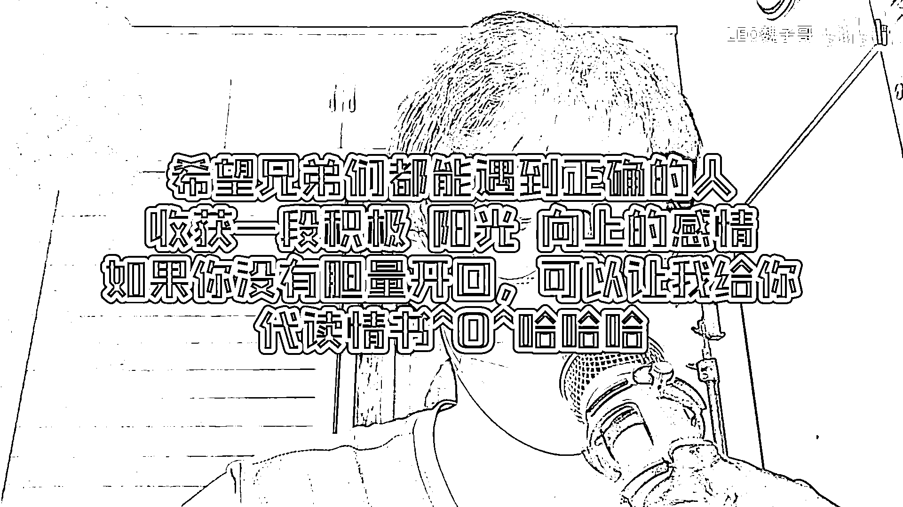

# 养鱼塘广撒网，为啥恋爱脑非要在

在本节课中，我们将探讨一种更高效、更健康的恋爱心态与策略。我们将分析为何过度专注于单一人选容易导致精神内耗，并学习如何通过拓展社交圈和进行低成本测试，来筛选出真正合适的伴侣，从而保护自己的情感与精力。

## 走出“唯一论”的误区

上一节我们介绍了课程主题，本节中我们来看看“专一痴情”思维的核心问题。很多人在爱而不得时陷入精神内耗，根本错误在于喜欢上一个人后，眼里便只有他。

但世界上能让你心动的人并非只有一个。请回想，在认识他之前，你也曾喜欢过别人，也曾发过毒誓说这辈子只喜欢那一个人，但那些感情现在都已结束。

## 策略转变：从“All in”到“分散投资”

理解了单一目标的局限性后，我们来看看更优的策略。与其不顾一切地向单一人选投入所有时间和精力，不如同时认识多个感兴趣的人，并进行低成本投入以测试他们的反馈。

以下是实施该策略的具体步骤：
1.  **拓展社交圈**：主动去认识更多新朋友。
2.  **低成本测试**：通过简单的互动（如聊天、分享兴趣）观察对方的反馈和态度。
3.  **重点培养**：将反馈积极、互动良好的人选作为重点发展对象。

这种方法显然更有效。对单一人选投入过多，必然伴随高期望，容易失望。而对多人进行投入，你的心态会更放松，容错率也更高。

## 构建自己的“鱼塘”：主动权的价值

我们常常羡慕那些游刃有余的人，其核心在于他们掌握了主动权。所谓“渣男渣女”的一个特点是他们认识相当多的异性。他们的逻辑是：一条“鱼”关系结束后，可以从“鱼塘”里再捞一条。

与其在别人的鱼塘里被动等待选择，为什么不自己构建一个鱼塘，并将感兴趣的人纳入其中呢？你或许会说，不想成为那样的人，只想在快节奏时代寻找真诚长期的伴侣。

但问题在于，你无法确定对方是否将你视为“鱼”，对方同样无法确定你的想法。在这种信息不对称的情况下，将彼此暂时置于“鱼塘”中进行观察和筛选，是一种务实的策略。公式可以简单表示为：
**恋爱效率 = （有效互动人数 × 互动质量） / 情感总投入**

## 识别信号：把精力留给对的人

策略的核心是筛选，而筛选的依据是对方的反馈。在对你没有兴趣的人身上付出完全没有意义。一个真正在乎你的人，不会让你在一段关系中持续煎熬，他会给出**正向反馈**，并让你看到关系的“进度条”。

如果你在与喜欢的人交往时感到持续难受，这往往说明他并不在乎你。与其耗费时间追逐一个永远追不到的目标，不如同时接触多人，筛选出那个“你喜欢且能追到”的人。这样你更舒服，付出成本更低，对方也不会感到过大压力。

大家都是成年人，没有多余精力浪费在不值得的人身上。

## 告别“自我感动”式付出

“恋爱脑”常陷入一种误区：用自虐式付出制造痴情假象，使自己站在感情道德制高点上，从而获得畸形的满足感与安全感。例如，给对方送一杯奶茶，自己回想起来觉得对方必定感动不已。

但对对方而言，一杯奶茶就只是一杯奶茶，承载不起你寄托其中的“山崩地裂”的情怀。少年时，我们总迫不及待地倾泻全部爱意，结果往往陷入自我表演而不自知。

成长意味着懂得克制，深情要留给值得的人。**被珍惜的才叫爱，不被珍惜的，那都叫自我感动。**

---

本节课中，我们一起学习了从“单点执着”到“多点测试”的恋爱策略转变。关键点在于：主动拓展社交圈、进行低成本互动测试、依据反馈筛选重点对象，以及将深情留给懂得珍惜的人。希望这套方法能帮助你更理性、更轻松地面对情感关系，减少精神内耗。