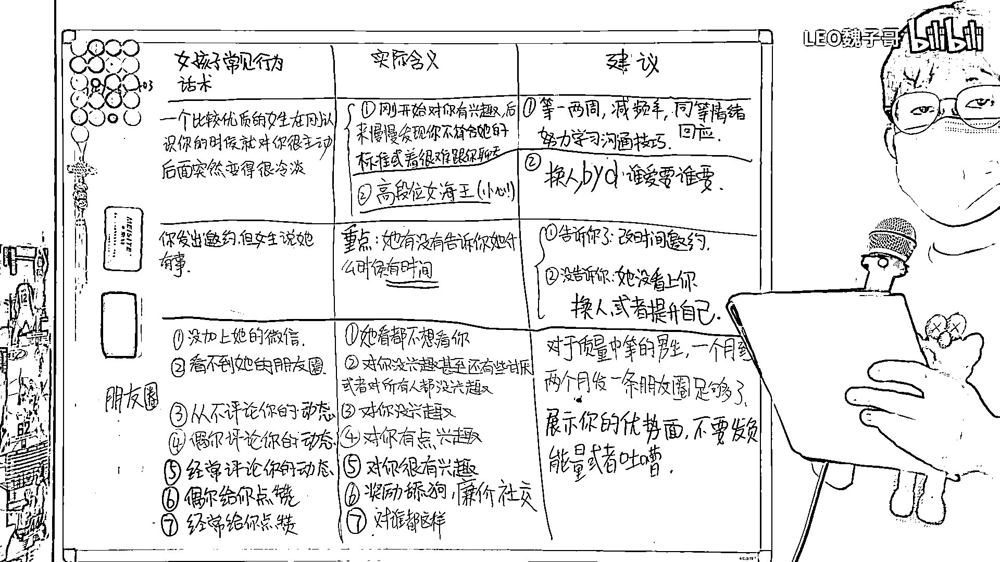

# 女生对男生经典话术、行为与实际含义一览表（沸羊羊大学习系列第二期）🎭

在本节课中，我们将要学习如何解读女生在与男生互动时的一些经典话术和行为，并理解其背后的实际含义。掌握这些知识，有助于你更清晰地判断关系状态，避免不必要的内耗和误解。

## 从热情到冷淡的转变 🔄

上一节我们介绍了课程概述，本节中我们来看看一种常见情况：一个原本对你主动的优质女生，在认识一段时间后突然变得冷淡。

这种情况通常有两种可能性。

以下是第一种可能性的应对策略：
*   **可能性一：兴趣减弱。** 女生最初对你有兴趣，但后续发现你不符合她的标准或沟通不畅。
*   **应对方法：** 暂停联系一两周，降低聊天频率和给对方带来的压力。
*   **核心原则：** 采取 **`对等情绪回应`** ，即她有多热情/冷淡，你就回应以同等的热情/冷淡。
*   **关键行动：** 利用这段时间提升沟通技巧与情商，因为你仍有机会挽回。

以下是第二种可能性的分析与建议：
*   **可能性二：遭遇“女海王”。** 对方可能是高段位玩家，擅长制造好感假象后突然抽离，以此让你“上头”并不断投入。
*   **核心目的：** 她可能意在获取你的**金钱、时间、情绪价值**，或享受操纵感。
*   **最终建议：** 一旦识别出这种模式，不要犹豫，立即止损换人。

## 邀约被拒的关键信号 🚫

理解了态度转变的含义后，我们来看看如何解读具体的拒绝话术。当你发出约会邀请被拒时，关键在于对方是否提供了替代方案。

以下是基于对方回应的两种解读：
*   **提供备选时间：** 如果对方说“**这次有事，但我下周三有空**”，这通常表示她确实愿意赴约，只是时间不合适。你只需改期即可。
*   **仅表示忙碌：** 如果对方只说“**我很忙**”而未给出任何可约时间，这基本意味着她没看上你。

面对第二种情况，你的最佳策略永远是：
1.  **换人。**
2.  **专注于提升自己。** 请记住，你的**财富、学识、健康体魄和积极心态**，远比任何女生都重要。所有技巧都建立在 **`你自身具备吸引力`** 这个前提之上。

## 朋友圈中的隐藏密码 📱

上一节我们分析了邀约中的信号，本节中我们最后来破解朋友圈互动中的密码。社交媒体的行为往往是内心态度的间接反映。

以下是关于“不加微信”与“屏蔽朋友圈”的解读：
*   **声称“只玩QQ”不加微信：** 这通常意味着对方不仅没兴趣，甚至不想与你有任何深入交集。
*   **加了微信但朋友圈不可见：** 这大概率表示对方对你没兴趣或有些反感，只是碍于情面才通过好友申请。另一种可能是她本身就不对任何人开放朋友圈。这两种情况都**无需挽回，直接换人**。

以下是关于朋友圈**互动行为**的层级解读，从低到高排列：
*   **从不评论：** 代表对你没有兴趣。
*   **偶尔评论：** 代表对你有些兴趣，可以尝试开启聊天。
*   **经常评论：** 代表对你很有兴趣，你已占据有利位置。
*   **偶尔点赞：** 这是一种**廉价的社交反馈**，旨在维持最低限度的联系，俗称“**奖励舔狗**”。对此不要抱有幻想，直接无视。
*   **频繁点赞（无论发什么都赞）：** 这通常是一种无意义的习惯性行为，她可能对谁都这样，并不真正关心你的内容。

最后，关于如何经营自己的朋友圈，给男生们的建议是：
*   **更新频率：** 对于条件中等的男生，**每月至每两月发一条**足矣。
*   **内容质量：** 只发布能**展示你优势和高价值**的内容。如果没有，宁可不发。
*   **内容禁忌：** 切记不要发布负能量、吐槽抱怨，尤其是**深夜emo（情绪化）文案**。

---

本节课中我们一起学习了如何解读女生从态度转变、具体话术到社交媒体行为背后的真实含义。核心在于保持清醒，识别无效投入，并始终将**自我提升**作为建立吸引力的根本。记住，你的价值是吸引一切的基础。