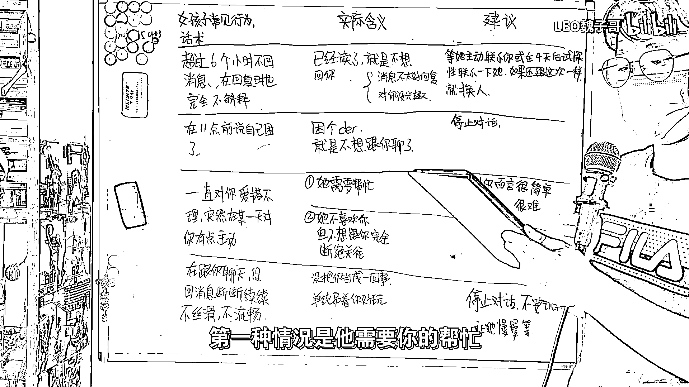

# 恋爱解码课 01：女生经典语言与行为含义解析 🧩

在本节课中，我们将学习男女交往过程中，女生常见的语言、行为及其背后的实际含义，并为缺乏经验的男生提供实用建议。我们将通过具体场景分析，帮助你更准确地理解对方意图，从而做出恰当回应。

## 消息回复延迟的含义与应对

上一节我们介绍了课程概述，本节中我们来看看第一种常见情况：消息回复延迟。

如果一个女生超过6小时未回复你的消息，且回复时未作任何解释，那么她已看到消息但不想回复。这通常分为两种情况。

以下是两种可能的原因及应对建议：

1.  **你的消息不便回复**  
    例如，你在上午询问一道数学题，但她全天在外游玩。此时消息内容与她的当下状态不匹配。

2.  **她对你不感兴趣**  
    这是可能性最大的情况。应对方法是：**立即停止主动联系，等待对方主动**。如果对方不再主动联系你，则应考虑放弃。

如果你非常喜欢这位女生，希望再次尝试，可以在四五天后进行试探性联系。若对方反应依旧冷淡，则无需再考虑。

## “我困了”与“我去洗澡了”的真实含义

了解了消息延迟的应对方法后，我们进一步分析女生结束聊天的常用借口。

女生说“我在11点前困了”，真实含义往往不是困倦，而是不想继续聊天。女生会根据时间选择不同的借口。

以下是不同时间点常见借口的含义：

*   **晚上10点至11点**：她会说“我困了”。
*   **晚上10点之前**：她会说“我去洗澡了”。

当听到这类借口时，意味着没有继续聊下去的必要。最佳做法是直接停止对话。

## 态度突然转变的两种可能

当女生从爱搭不理变得突然主动，这通常不是关系转好的信号，而是另有原因。

这种情况一般有两种可能性。

以下是两种可能性及各自的应对策略：

1.  **她需要你的帮助**  
    *   **如果帮忙对你而言很简单**：你可以装出为难的样子，让她感到些许不好意思。然后，在6小时后再帮她解决。
    *   **如果帮忙非常困难，需耗费大量时间精力**：建议直接拒绝，甚至无需多言。

2.  **她把你当备胎**  
    她并不喜欢你，但也不想完全断绝联系，即“不想丢掉你这条狗”。应对方法是：**表现得冷淡一些**，让她明白你并非一个可以轻易被满足和掌控的人。

## 回复消息不连贯的潜在信号

最后，我们来看一种较为隐蔽的聊天状态所传递的信号。

如果女生在聊天时回复消息断断续续、不流畅，这同样是一个需要警惕的信号。

这通常意味着以下两种情况之一：

*   她在边玩边聊，并未认真对待与你的对话。
*   她只是在逗你玩，寻求消遣。

遇到这种情况，正确的做法是：**立即停止对话，连“再见”都不必说**，让她等待即可。

---

本节课中，我们一起学习了四种常见场景下女生语言行为的真实含义及应对策略：**消息延迟**、**聊天借口**、**态度突变**和**回复不连贯**。核心在于通过现象看本质，**及时停止无效投入**，保护自己的时间和情感。记住，真诚的关系不需要费力解码，双向的奔赴才有意义。

请不吝点赞、订阅、转发、打赏支持明镜与点点栏目。