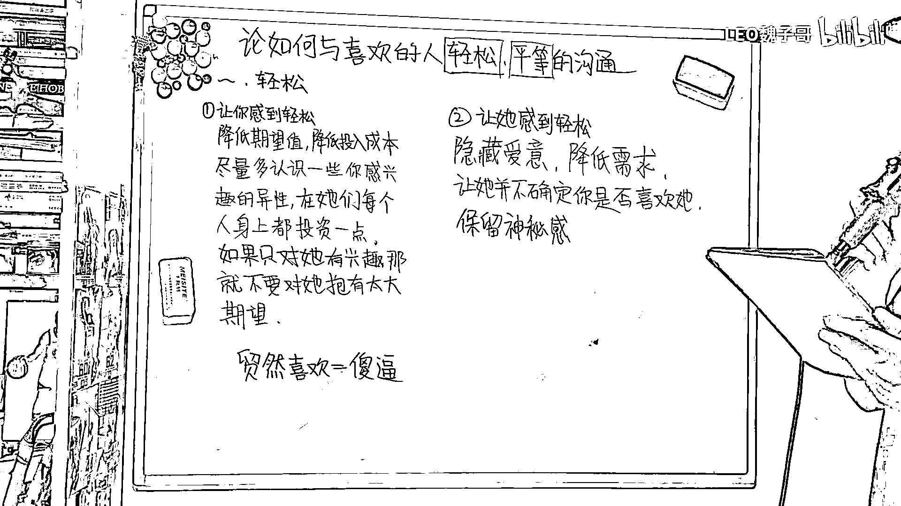
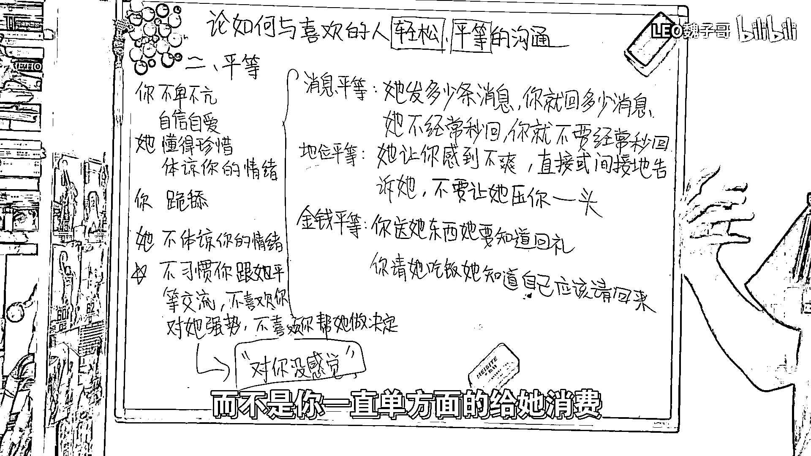

# 必看！如何与喜欢的女生轻松平等的沟通？🔥（沸羊羊大学习附加课 - P1）

在本节课中，我们将要学习如何与自己喜欢的女生进行轻松且平等的沟通。我们将从反思自然界的现象开始，逐步分析核心原则，并拆解“轻松”与“平等”的具体实践方法。

## 反思自然界的启示 🌍

上一节我们介绍了课程目标，本节中我们来看看自然界能给我们什么启发。在自然界中，雄性动物为了不错过交配时间，往往会直接向雌性展示自身条件。

如果遭到拒绝，雄性会立即寻找下一个目标，不会在同一个对象身上浪费时间。这个行为的核心逻辑是降低对单一目标的期望值，避免过度投入。

从生理角度分析，雄性每天能产生大量精子，发生关系的代价很小，且不承担生育责任，因此更倾向于主动。雌性则需要很长时间才能成熟一个卵子，且需承担生育责任，发生关系的代价很大，因此行为更被动。

## 实现轻松沟通的核心：降低期望与隐藏需求 🪂

上一节我们了解了自然界的规律，本节中我们来看看如何将其应用于人际沟通，实现“轻松”的氛围。让你自己感到轻松的核心是降低你对她的期望值，不要在她身上投入过多。

如果你社交圈子窄或近期无精力社交，就必须对你感兴趣的女生保持很低的期望，先把她当成普通朋友看待。

在对方未表现出明确兴趣信号时，仅因她的长相或某些行为就将她定义为喜欢的人，这是不明智的。让她感到轻松的方式，则是隐藏你的爱意，让她感觉不到你的强烈需求感。

让她不确定你是否真的喜欢她。人总是对捉摸不透的事物充满好奇，因此保留神秘感至关重要。不要一次性全部展示你的优点，要让她慢慢了解你，从而长时间带给她新鲜感。

## 实现平等沟通的三个维度 ⚖️

上一节我们探讨了如何营造轻松感，本节中我们重点分析“平等”的具体内涵。平等沟通主要可分为三个方面：消息平等、地位平等和金钱平等。

以下是每个方面的具体实践方法：

*   **消息平等**：她发多少条消息，你就回多少条。如果她不经常秒回，你也不必经常秒回。如果你对她每条消息都秒回，会让她感觉你过于在乎她、渴望收到她的消息，效果反而不好。
*   **地位平等**：如果她做了让你不舒服的事情，你要直接或间接地告诉她，而不是始终让她压你一头。
*   **金钱平等**：你送她礼物，她应该知道回礼；你请她吃饭，她应该知道有时也该回请。而不是你一直单方面消费。

做到平等非常重要。如果你能不卑不亢、自信自爱，她就会懂得珍惜和体谅你的情绪。如果你一直卑微讨好，她就不会体谅你的情绪。

最关键的一点是，如果她不习惯与你平等交流，始终觉得你低她一等，她就不会喜欢你对她强势或帮她做决定。但在恋爱关系中，女生有时又希望男生能偶尔强势一点、帮她做决定。

如果你们长期处于不平等状态，当你偶尔尝试强势时，她会不习惯。最终可能导致她对你说“我对你没感觉，你是个好人”这样的结局。

---

本节课中我们一起学习了与喜欢女生沟通的两大核心：**轻松**与**平等**。实现轻松的关键在于**降低自身期望**与**隐藏需求感**；实现平等则需要贯彻**消息、地位、金钱三个维度的对等原则**。保持自信、不卑不亢的态度，是建立健康互动关系的基础。