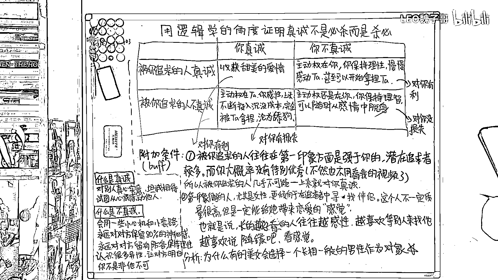

# 用逻辑学的角度证明真诚不是必杀

在本节课中，我们将从逻辑学的角度分析人际交往中的“真诚”策略，探讨其潜在的风险与收益，并学习如何在复杂的情感互动中做出更理性的选择。

## 核心概念定义

首先，我们来明确“真诚”与“不真诚”这两个核心概念的定义。

*   **真诚**：指对别人真心实意，坦诚相待，试图从心底感动他人。
*   **不真诚**：指运用一些小心机或小套路，始终对对方保留一部分神秘感和防备，保持理性，并拥有多个社交选择，让对方明白你并非非他不可。

## 策略推演与收益分析

上一节我们定义了核心概念，本节中我们来看看在不同策略组合下，可能产生的结果。

我们可以将追求者与被追求者的策略简化为一个收益矩阵。假设追求者有“真诚”与“不真诚”两种策略，被追求者同样有这两种策略。

以下是基于策略互动的四种可能情况及其结果分析：

1.  **你真诚，对方也真诚**：恭喜你，这通常能开启一段甜美的爱情。双方平等，关系健康。
2.  **你真诚，对方不真诚**：此时主动权完全在对方手中。你容易变得感性、上头，不断投入**沉没成本**，最终可能被对方拿捏，甚至沦为“舔狗”。
3.  **你不真诚，对方真诚**：此时主动权在你手中。你可以保持理性，逐步感动对方，甚至最终掌握关系的主导权。
4.  **你不真诚，对方也不真诚**：主动权依然在你。因为你保持理智，可以随时从这段感情中抽身，不会遭受损失。

通过以上分析，我们可以进行一个简单的逻辑总结：

*   选择“真诚”，你有可能获利（情况1），也有可能蒙受损失（情况2），且在实际中，蒙受损失的概率往往更大。
*   选择“不真诚”，情况要么对你有利（情况3），要么对你没有损失（情况4）。

因此，从纯粹的逻辑推演来看，**保持“不真诚”的策略，似乎能永远保证你获得最大利益或避免损失**。

## 现实情境的附加条件

然而，单纯的理论推演不足以应对复杂的人性。因此，我们需要引入几条现实中的附加条件，使模型更贴近实际。

以下是几个关键的现实考量因素：

*   **第一印象差距**：通常，你追求的对象在第一印象（如颜值、身材）上强于你。这类人往往拥有众多追求者，因此他们一开始就对你“真诚”的可能性极低。这意味着上述“双方都真诚”的理想情况在关系初期基本不会出现。
*   **高价值者的行为模式**：给人第一印象好的人（尤其是女性），更倾向于在追求者中选择伴侣。她们寻找的未必是条件最优的，而是能带来“恋爱感觉”和舒适感的人。因此，外表越出众的人，可能越感性，越喜欢被动等待。
*   **逆袭的关键**：一个外貌并不出众的追求者，如果能做到不卑不亢、聊天得体有分寸、在异性圈中受欢迎，并拥有一两个能偶尔展示的特长来增加神秘感，就很容易从众多追求者中脱颖而出。此时，再辅以一些技巧增加对方的**沉没成本**，时间一长，对方便可能产生依赖感。

## 实践策略总结

本节课中我们一起学习了“真诚”策略的逻辑推演和现实应用。最后，根据自身条件，我们可以总结出不同的实践策略。

以下是针对不同人群的行动建议：

*   **如果你自身条件优越**：你可以选择“随缘”，保持感性，等待别人来追求。但请注意，这种策略通常意味着你只能进行“向下兼容”，即选择条件不如你的伴侣。
*   **如果你条件普通但想追求优质对象**：你需要减少盲目的真诚，保持理性。具体做法包括：扩展社交圈子（广撒网）、保持自身神秘感、并在合适的时机运用一些增进关系的小技巧。

**总结**：在复杂的情感博弈中，盲目的“真诚”并非万能钥匙，有时甚至会让自己陷入被动。理解策略背后的逻辑，并根据实际情况灵活调整自己的行为模式，才是更明智的选择。本节课的核心在于，**理性分析优于感性冲动，策略思维有助于在人际关系中保护自己并达成目标**。

---
按讚&追蹤臉書FB: @FASHIONECSTASY。