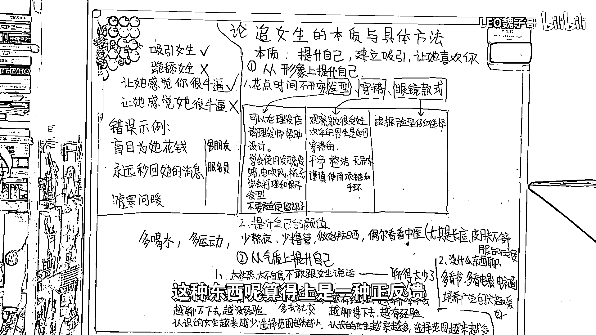
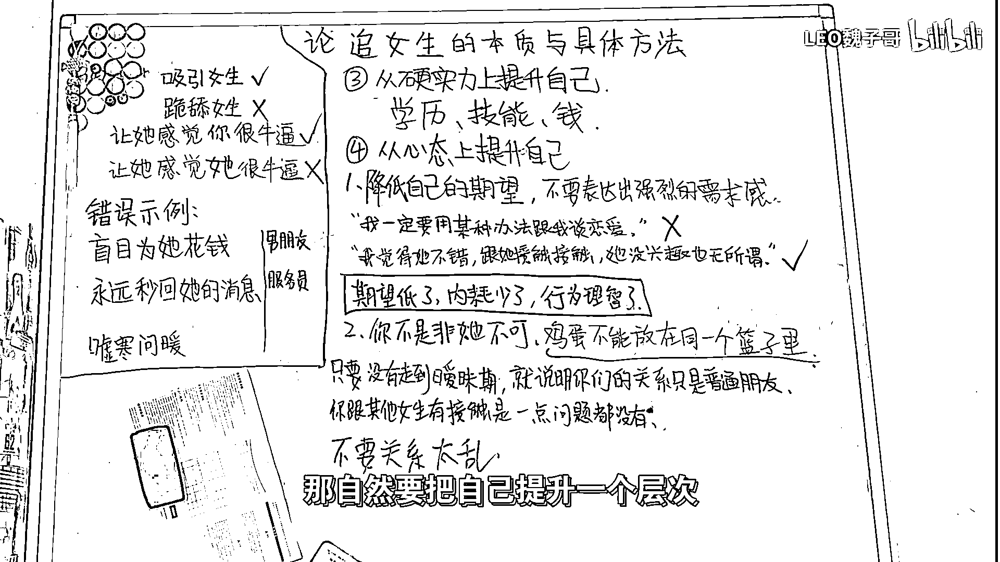

# 追女生的本质与具体方法 🎯（沸羊羊大学习系列第五期）

在本节课中，我们将要学习追女生的核心本质，并拆解为四个具体、可执行的提升步骤。课程将帮助你理解，建立吸引远比盲目付出更为重要。

追女生的本质是**吸引女生**，而不是跪舔女生。最终目标是让她感觉到你很优秀，进而喜欢你。不是让她感觉到她很厉害，可以掌控你。

如果你面对喜欢的女生时，不去思考如何吸引她，只是盲目为她花钱、永远秒回信息、或经常嘘寒问暖，那么你很难成功。

因为对方需要的是一个能吸引她、并能不断带来新鲜感的男朋友，而不是舔狗。因此，追女生的本质是**提升自己，建立吸引**，让她喜欢你。

---

## 第一步：提升外在形象 👔

上一节我们明确了吸引的本质，本节中我们来看看如何迈出第一步。三观决定了两个人能否长久在一起，而**形象决定了对方是否愿意认识你**。

如果你顶着黑眼圈、脸上油腻、穿着发黄的白T恤、还不修边幅，没有人会愿意认识你。所以，第一步必须提升个人形象。

以下是提升形象的具体方向，你可以直接参考：
*   **个人卫生**：保持面部清洁，打理发型。
*   **穿着打扮**：选择合身、干净、得体的衣物。
*   **精神面貌**：保持良好作息，改善体态。

---

## 第二步：培养自信气质 💬

完成了外在形象的初步建设，接下来我们需要从内在气质上提升自己。关键在于面对女生时能否不怯场、敢于聊天、保持自信、举止得体。

如果你太害羞、不自信、不敢和女生说话，通常是因为你和异性聊得太少，缺乏相处经验。这是一种**正反馈循环**：越没经验，就越聊不好；越聊不好，就越没经验，认识女生的机会就越少。

反之，**越有经验，就越聊得好；越聊得好，就越有经验**，认识女生的机会就越多，选择范围也更广。

如果你想打破现状，就必须主动增加与异性的接触。你需要出门寻找机会认识女生，而不是待在家里空想。

以下是几种可行的社交途径：
*   前往社交属性强的场所（如咖啡馆、展览、兴趣活动）。
*   参加社团或组织。
*   尝试礼貌的街头搭讪。
*   减少独自打游戏、刷视频或只进行单一性别活动的时间。

另一方面，如果你觉得和女生聊天缺乏话题，就需要拓宽知识面。

以下是丰富谈资的建议：
*   多看书、看电影电视剧。
*   培养一些兴趣爱好。

---

## 第三步：增强个人硬实力 🏆

在打磨了外在形象与社交气质后，我们需要关注更基础的层面——个人硬实力。所谓硬实力，指的是你的学历、专业技能和财富积累。

优秀的人通常希望与优秀的人结伴。如果你想吸引更优质的伴侣，就必须将自己提升到相应的层次。

提升硬实力是一个长期过程，核心在于持续投资自己：
*   **学历/技能**：通过学习和实践提升专业能力。
*   **事业/财富**：专注于职业发展，创造经济价值。

---

## 第四步：调整核心心态 🧠

前面三节我们探讨了形象、气质和硬实力等具体方法，本节我们来看看我个人认为最重要的一点：心态调整。很多男生遇到喜欢的人容易“上头”，而“上头”意味着失去理智。

对于男性而言，**理性是我们最强大的武器**，永远不能放弃。当你遇到一个感兴趣的人时，第一反应不应该是“我必须让她和我谈恋爱”，而应该是“我觉得她不错，可以接触一下。如果她没兴趣，我也无所谓”。

**降低期望值，可以减少精神内耗，让行为更理智**。这样对方感觉不到你的强烈目的性，聊天压力小，自然更愿意接触。同时，你必须记住：你不是非她不可。

你不是动漫男主角，没有哪个女生会对你一见钟情。请收起专一的“恋爱脑”，不要把所有精力押注在一个人身上。

在关系进入暧昧期之前，你们只是普通朋友。多接触其他女生完全没有问题。甚至，如果你能与其他女生相处得体、大方、有分寸，在你喜欢的人看来，这可能是一个加分项。

但这里必须切记：
*   关系不要混乱。
*   不要带其他女生去喝酒并共处一室。
*   **不要刻意向喜欢的人展示你与其他女生的聊天记录来施加压力**，这只会让你被立刻拉黑。

---

## 总结 📝

本节课中我们一起学习了追女生的核心逻辑与具体方法。我们明确了追女生的本质是**提升自我并建立吸引**，而非跪舔。

具体方法可分为四步：**提升外在形象**、**培养自信气质**、**增强个人硬实力**以及最重要的**调整核心心态**。记住，理性、自信和持续的自我成长，才是获得健康关系的基础。

希望本系列课程能对你有所帮助。这是沸羊羊大学习系列的最后一期，感谢你的观看。