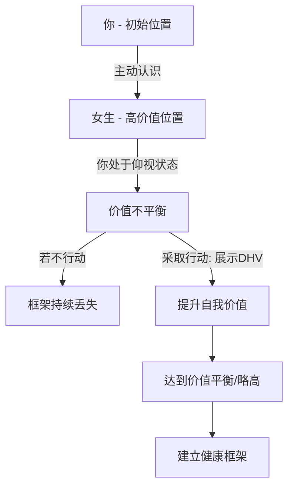

# 连招1.0学习训练系统完整版 课程1：靖峰-思维导图：如何聊妹子之框架详解 🧠

在本节课中，我们将要学习与女性互动中一个至关重要的概念：**框架**。我们将通过具体案例和图示，深入浅出地理解什么是框架，为何它会丢失，以及如何建立并维持一个健康的互动框架。

## 概述：什么是框架？

框架，简单来说，是你在与女性互动时所持有的**自我意识、原则和主导权**。它决定了你们关系的走向和平衡。很多男性在遇到心仪的女性时，会因为过度暴露需求感而丢失框架，导致关系陷入被动。

上一节我们介绍了课程的整体结构，本节中我们来看看框架的具体含义和重要性。

## 框架丢失的常见案例

以下是几个典型的因框架丢失而导致互动失败的例子：

*   **案例一：过度投资与焦虑**。一位学员遇到喜欢的女生后，情绪完全被对方牵动。女生回复慢一点，他就焦虑不安，饭也吃不好，觉也睡不好。他将过量的情感价值投资在对方身上，却不敢在关系升级的关键时刻（如私密空间独处）采取行动，最终陷入友谊区。
*   **案例二：错失关系升级良机**。另一位学员与女生约会至深夜，女生明确表示可以不回家。然而共处一室时，学员只敢在女生睡着后偷偷牵手，错失了将关系亲密化的机会。事后又因为过度在意女生的情绪而患得患失。
*   **案例三：无原则的付出**。有学员每次约会都自己掏钱，当女生以各种理由拒绝付出时，他选择了妥协。这种无底线的付出，使得他在关系中丧失了框架和尊重。

这些案例的共同点在于：男性在互动中处于**仰视**对方的位置，将自己的喜怒哀乐交由对方决定，从而丧失了关系的主动权。

## 框架的核心：价值平衡

为了理解框架，我们引入一个价值坐标模型。

假设你（A点）和心仪的女生（B点）最初互不相识，处于平行线上。当你主动去认识她（如搭讪、社交软件打招呼），这个行为本身就意味着你认可了她的价值，此时你在心理上处于**仰视**她的位置（B点价值高于A点）。

如果此时你不采取任何措施来提升自我价值，你们的价值线将永远保持这种不平衡，你将持续丢失框架。

**关键在于：你必须通过展示高价值（DHV），将自身价值提升到与女生平行甚至略高的位置。**



## 如何展示高价值（DHV）？

展示高价值并非炫耀财富，而是通过**精神层面和生活方式**的吸引力来建立框架。

上一节我们了解了价值平衡的重要性，本节中我们来看看如何通过DHV实现它。

以下是展示高价值的正确方式：

*   **展示生活态度**：在朋友圈分享你下厨的过程（从买菜、备菜到成品），这传递出你热爱生活、能照顾自己的信息。公式是：**生活DHV = 积极行为 + 可视化成果**。
*   **展示独特技能**：例如在户外烧烤时展现你的手艺。重点不在于完美，而在于参与和创造乐趣的过程。
*   **精神层面优先**：对于物质条件已很丰富的女性，比拼物质往往无效，甚至可能吸引来只重视物质的异性。应通过你的人格魅力、兴趣爱好和生活情趣来吸引对方。

当你成功展示出对方所欣赏的高价值时，你的价值线会上升，从而建立平等或略微主导的框架。

## 框架的弹性：原则与风格

拥有框架不等于固执己见。一个魅力男人懂得区分原则问题和小事，做到收放自如。

以下是处理不同性质事务的框架策略：

*   **大事讲原则（框架要紧）**：涉及底线和核心利益时，绝不能退让。例如，伴侣在承诺的事情上失信（如夜归不报备），或出现欺骗行为。此时必须坚定表达立场和不良感受，目的是让对方明确你的底线。代码逻辑可表示为：
    ```python
    if 事件触及底线:
        反应 = 坚定表达立场 + 要求合理解释
        目标 = 让对方长记性
    ```
*   **小事讲风格（框架可松）**：对于无伤大雅的琐事或女生的撒娇调情，不必争辩。例如女生开玩笑说“苹果是地上长的”，你可以顺势调侃：“好，你说得对，那下次请你给我洗个‘地上长的’苹果吧。”这既保持了风度，又以退为进创造了新的互动机会。公式是：**小事情回应 = 幽默接受 + 顺势调侃/提出小要求**。

框架就像**方向盘**，始终要掌握在你手中。你可以允许乘客（女生）提建议，甚至偶尔让她碰一下方向盘，但最终行驶的方向和目的地应由你决定。

## 风险与内化：避免极端

在运用框架时，务必把握尺度，避免走向极端。

*   **过度展示**：幽默过头会变成小丑，框架太硬会显得难以接近。应保持**中道**，根据实际情况灵活调整。
*   **价值过高**：如果你的价值展示远超对方，令对方感到自卑和不是一个世界的人，她可能会主动退出。此时应适当“拉对方一把”，给予对方融入你世界的窗口和机会。例如，当女生问“你这么优秀怎么还没女朋友？”时，可以回答：“我在等一个真正懂我的人。”（暗示对方有机会成为这个人），而不是说“我要求很高”。
*   **内化于心**：学习理论后，关键在于内化和练习。多参照课程提供的“天梯”进行自我心境评估，并将“炮女人、炮男人、炮生活、炮自己”的理念融入日常，不断反思精进。

## 总结

本节课中我们一起学习了**框架**这一核心概念。

我们明白了框架的本质是**价值平衡**与**主导权**。通过避免过早过度投资、在关键时刻勇敢升级关系、以及有原则的付出，可以防止框架丢失。我们学习了通过展示**精神层面和生活方式的高价值（DHV）**来提升自我价值线，以达到健康平衡。更重要的是，我们认识到框架应有弹性：**在原则底线上坚定不移，在无关紧要的小事上灵活幽默**。最后，我们探讨了避免运用框架时走向极端，并强调将理论内化于心、实践于行的重要性。

记住，强大的框架来自于稳定的内心和清晰的自我认知，这需要你在日常生活中持续修炼。